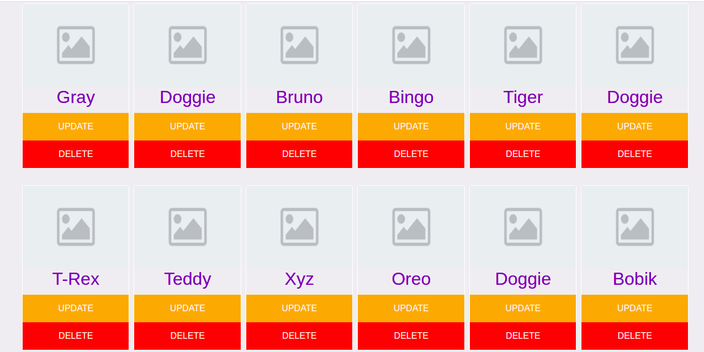
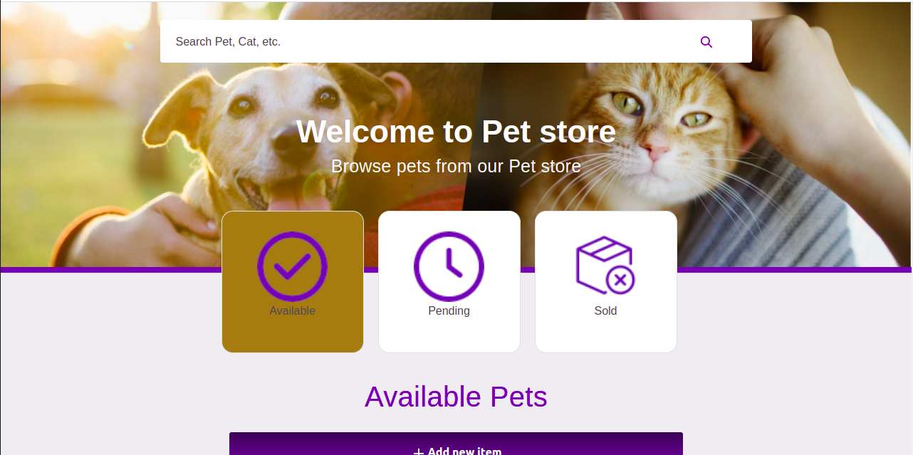
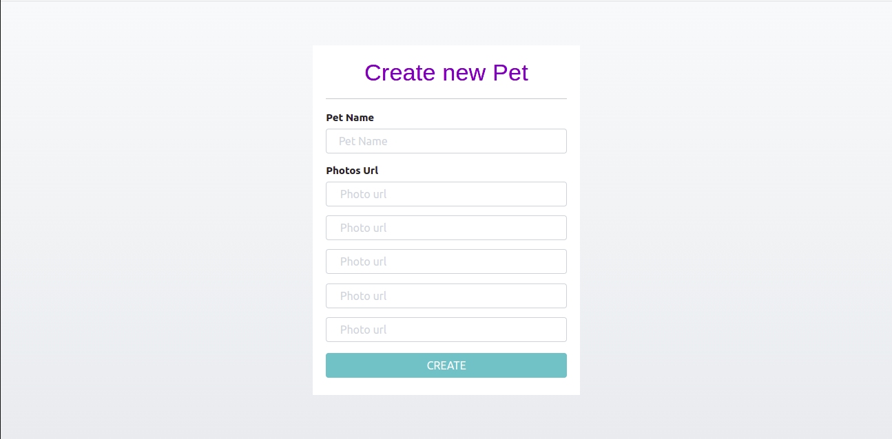

# TODOLIST
> In this Project, I created a Pet Store front-end on MVC architecture with CRUD principles , in order to allow users add, update, delete pets and get a list of availables, pending and sold pets. Users can also use search engine to fetch pets by key words and leverage from many others features whih can made his experience very rich while navigating the website.
## Project Preview

App-Preview                         
:---------------------------------------------------------------------------------:
  

Desktop-Home                             
:---------------------------------------------------------------------------------:


Desktop-Add-Item                             
:---------------------------------------------------------------------------------:



## Front-end Live Demo
> Click [here](https://taher-pet-store.netlify.app/) to see the live preview of the project.

> [link to Backend](https://petstore.swagger.io/)

### Built With

- [React](https://es.reactjs.org/)
- [Redux](https://redux.js.org/)
- [JS](https://www.javascript.com/)
- [HTML](https://www.w3schools.com/html/)
- [CSS](https://www.w3schools.com/css/)
- [REACT-BOOTSTRAP](https://react-bootstrap.github.io/)
- [@MUI/MATERIAL](https://mui.com/)

# Getting Started with Create React App

This project was bootstrapped with [Create React App](https://github.com/facebook/create-react-app).

### Installation

1. Clone the repository
   ```sh
   git clone https://github.com/Taher-web-dev/Pet-store
   ```
2. Install NPM packages
   ```sh
   npm install
   ```
3. Run server
   ```sh
   npm start
   ```
   
## Authors

👤 **Taher Haggui**

- GitHub: [@Taher-web-dev](https://github.com/Taher-web-dev)
- LinkedIn: [LinkedIn](https://www.linkedin.com/in/taher-haggui/)


## 🤝 Contributing

Contributions, issues, and feature requests are welcome!

Feel free to check the [issues page](../../issues/).


## Show your support

Give a ⭐️ if you like this project!